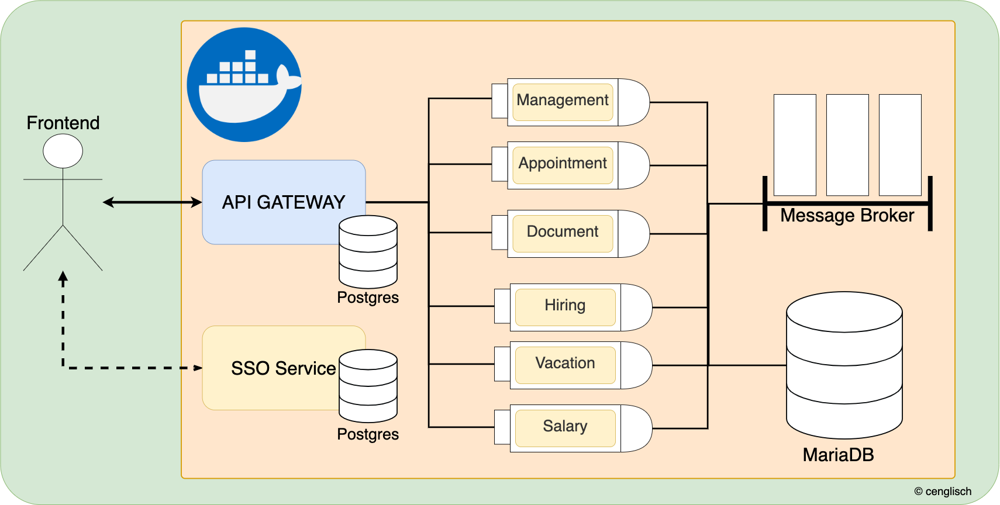

# Company Management

## Table of Contents:
<!-- TOC -->
* [Company Management](#company-management)
  * [Table of Contents:](#table-of-contents-)
  * [Einleitung](#einleitung)
* [System](#system)
* [Architektur](#architektur)
  * [Hexagonal](#hexagonal)
  * [DDD](#ddd)
<!-- TOC -->

The following description is written in German, but the code and other dependencies are based on the English language. It will be worth to translate the following text into English ;) P.S. use deepl.com

## Einleitung
Dieses Projekt soll meinen Umgang mit einer Fullstack Anwendung repräsentieren.  
 
Wieso habe ich mir gerade dieses fachliche Projekt der Firmenverwaltung ausgesucht?  
Der Grund dafür ist, dass die Prozesse eines solchen Projektes leicht durchschaubar sind und dafür nicht besondere Kenntnisse in einem Bereich benötigt werden.  
Mir war es aber trotzdem wichtig, dass viele Module entstehen, welche Unternehmensprozesse abbilden. 
Somit soll ein System entstehen, welches verteilte Services bereitstellt.

Das Projekt wurde zu Beginn aus der Sicht der Fachabteilung geplant.  
Danach wurde aus der Sicht des Entwicklers Code geschrieben, welcher sich aber nicht von der entstandenen Fachsprache abwendet.
 
# System

# Architektur
## Hexagonal
Austauschbarkeit der Infrastruktur: 
Nicht nur Frameworks oder Bibliotheken, sondern auch Technologien also sollen ohne Probleme austauschbar sein. 
Bei der Infrastruktur wird dies durch technische Definition in den einzelnen Subordnern und den deren resultierenden Docker Containern gewährleistet. 
 
Von den Containern werden services wie gateway oder auch queue bereitgestellt, hier wurde sich gegen eine  
Benamung wie die direkte software entschieden also Kong oder RabbitMQ. 
 
Im backend, wird dann für die Austauschbarkeit eine hexagonale Architektur verwendet.  
Das hat den Charm, dass ich auch auf Frameworks wie Micronaut oder Quarkus ausweichen kann. 
In der Zukunft ist auch geplant die genannten Rahmenwerke auszutauschen und einen Performancetest durchzuführen. 

## DDD

Es gab auch Services, welche ein Teil eines Schulprojekts waren.  
Diese Präsentation kann man ebenfalls unter dem docs Ordner finden. 