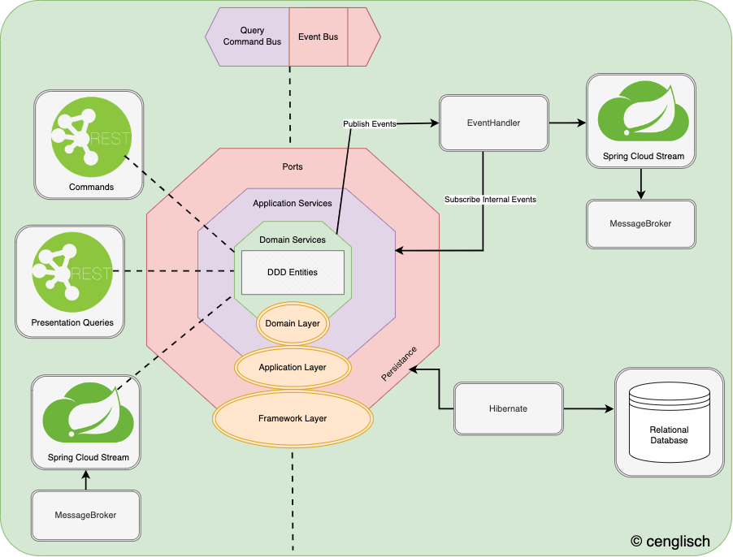

# Company Management

## Table of Contents:
<!-- TOC -->
* [Company Management](#company-management)
  * [Einleitung](#einleitung)
* [Infrastructure](#infrastructure)
* [Architektur](#architektur)
  * [Hexagonal](#hexagonal)
  * [DDD](#ddd)
<!-- TOC -->

The following description is written in German, but the code and other dependencies are based on the English language. It will be worth to translate the following text into English ;) P.S. use deepl.com

## Einleitung
Dieses Projekt soll meinen Umgang mit einer Fullstack Anwendung repräsentieren.  
 
Wieso habe ich mir gerade dieses fachliche Projekt der Firmenverwaltung ausgesucht?  
Der Grund dafür ist, dass die Prozesse eines solchen Projektes leicht durchschaubar sind und dafür nicht besondere Kenntnisse in diesem Bereich benötigt werden.  
Mir war es aber trotzdem wichtig, dass viele Module entstehen, welche Unternehmensprozesse abbilden. 
Somit soll ein System entstehen, welches verteilte Services bereitstellt.

Das Projekt wurde zu Beginn aus der Sicht der Fachabteilung geplant. Sichtbar im Event-Storming im docs folder.
Danach wurde aus der Sicht des Entwicklers Code geschrieben, welcher sich aber nicht von der entstandenen Fachsprache abwendet.
 
# Infrastructure

# Architektur

## Hexagonal

Austauschbarkeit der Infrastruktur: 
Nicht nur Frameworks oder Bibliotheken, sondern auch Technologien sollen ohne Probleme austauschbar sein. 
Bei der Infrastruktur wird dies durch technische Definition in den einzelnen Subordnern und den deren resultierenden Docker Containern gewährleistet. 
 
Von den Containern werden Services wie gateway oder auch queue bereitgestellt, hier wurde sich gegen eine 
direkte Benamung der Software entschieden also Kong oder RabbitMQ. 
Damit sollten daraus resultierende feste Abhängigkeiten an Services unterbunden werden.
 
Im Backend, wird eine hexagonale Architektur verwendet. Das hat den Charm, dass ich auch auf Frameworks wie Micronaut oder Quarkus ausweichen kann. 
In der Zukunft ist auch geplant die genannten Rahmenwerke auszutauschen und einen Performancetest durchzuführen. 

## DDD
Um keine Unterscheidung zwischen technischer Sprache und fachlicher Sprache zu gewährleisten, wurde auf Basis von DDD entwickelt. 
Alle Commands die in das System implementiert wurden, sind gleich mit den Befehlen in der fachlichen Abteilung, siehe Event-Storming.

## Grobe Erklärung der Module nach Fachlichkeit
* appointment 
  * Verwaltung von internem Terminkalender
* document
  * Ablage von Dokumenten wie z.B. Bewerbungsunterlagen
* hiring 
  * Abbildung des Geschäftsprozesses einer Bewerber Einstellung
* management 
  * Verwaltung von Personalinformationen

Es gab auch Services, welche ein Teil eines Schulprojekts waren.  
Diese Präsentation kann man ebenfalls unter dem docs Ordner finden. 